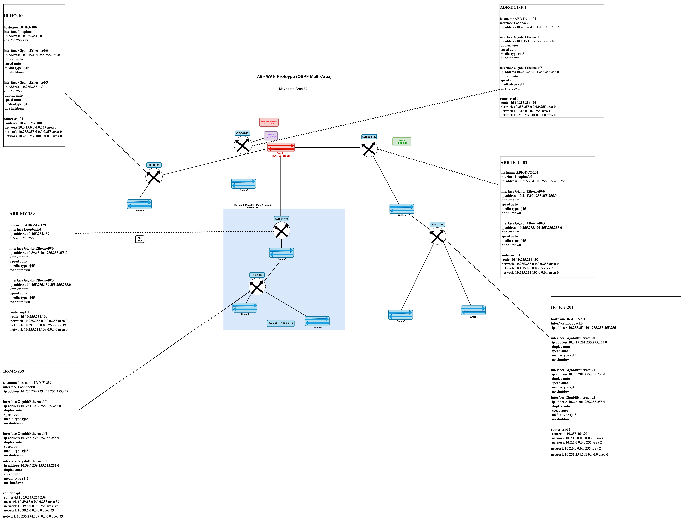
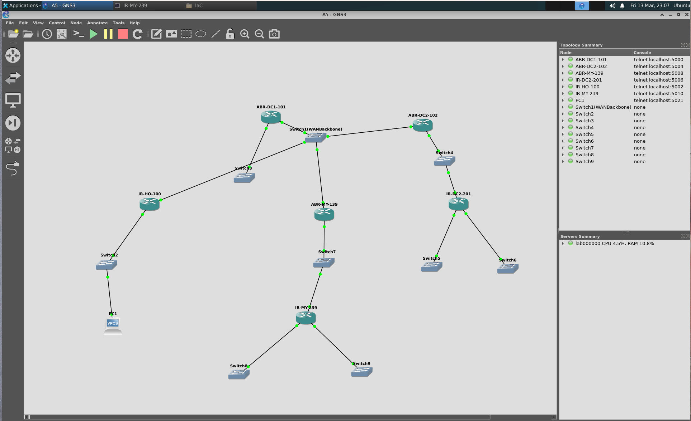
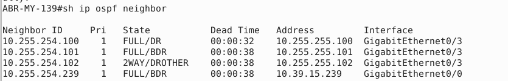
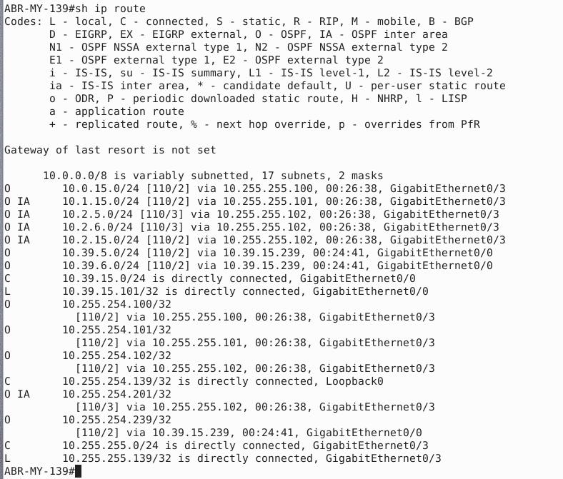
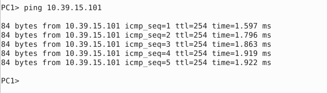
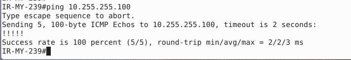

# Assignment 5 - WAN Prototype with OSPF


```
**Student:** Pase Ayobami
**Student ID:** L00196785
**Site Allocation:** Maynooth — Network `10.39.0.0/16`
**Date:** 14th March 2026
```

---

## What was Built

A WAN protoype connecting four sites using OSPF multi are routing. Each site has its own OSPF area, and all sites connect to each other through a shared backbone (Area 0)


 Site | Router(s) | Network | OSPF Area |
|------|-----------|---------|-----------|
| Head Office | IR-HO-100 | 10.0.0.0/16 | Area 0 |
| Data Centre 1 | ABR-DC1-101 | 10.1.0.0/16 | Area 1 |
| Data Centre 2 | ABR-DC2-102, IR-DC2-201 | 10.2.0.0/16 | Area 2 |
| **Maynooth** | **ABR-MY-139, IR-MY-239** | **10.39.0.0/16** | **Area 39** |

The WAN backbone runs on `10.255.255.0/24` and connects all four sites through Area 0.

## Diagrams & Topology

- **WAN Overview**  
  

- **GNS3 Topology**  
  


  ## Device List

| Device | Role | WAN IP (Gi0/3) | Local IP (Gi0/0) | Loopback |
|--------|------|---------------|------------------|----------|
| IR-HO-100 | Head Office router | 10.255.255.100/24 | 10.0.15.100/24 | 10.255.254.100/32 |
| ABR-DC1-101 | DC1 Area Border Router | 10.255.255.101/24 | 10.1.15.101/24 | 10.255.254.101/32 |
| ABR-DC2-102 | DC2 Area Border Router | 10.255.255.102/24 | 10.2.15.101/24 | 10.255.254.102/32 |
| IR-DC2-201 | DC2 Internal Router | — | 10.2.15.201/24 | 10.255.254.201/32 |
| **ABR-MY-139** | **My site ABR** | **10.255.255.139/24** | **10.39.15.101/24** | **10.255.254.139/32** |
| **IR-MY-239** | **My site IR** | — | **10.39.15.239/24** | **10.255.254.239/32** |


> All router scripts are in the `scripts` folder.


## Loopback Interfaces
A loopback interface was configured on every router using the `10.255.254.0/24` 
range. Loopbacks provide a stable, always-up interface used as the OSPF Router ID.


## Tests Conducted

### Test 1 — OSPF Neighbours (ABR-MY-139)
Confirmed IR-MY-239 and IR-HO-100 are listed as OSPF neighbours in FULL state.



### Test 2 — Routing Table (ABR-MY-139)
Confirmed OSPF routes (O and O IA) are present for all remote networks.



### Test 3 — Ping from PC1 to ABR-MY-139
Confirmed PC1 can reach the Maynooth ABR — all 5 pings succeeded.



### Test 4 — Ping Across the WAN (IR-MY-239)
Pinged IR-HO-100 (10.255.255.100) from IR-MY-239 — 100% success rate, 
confirming OSPF routing works across the full WAN backbone.




## Router Configs
Each router's configuration is saved as a `.txt` file in the `scripts` folder. 
Configs include interface IPs, OSPF process, network statements, and loopback setup.


## Project Structure

```
A5/
├── A5_GNS3/
│   └── (GNS3 project files)
├── scripts/
│   └── (configuration scripts)
├── testing/
│   └── (testing screenshots)
├── A5_WAN_Overview.drawio.png
├── Topology.png
└── README.md
```
