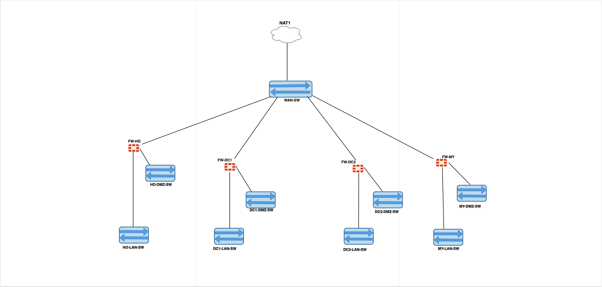
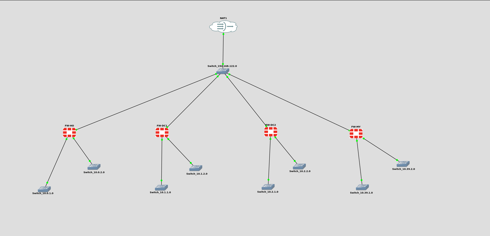
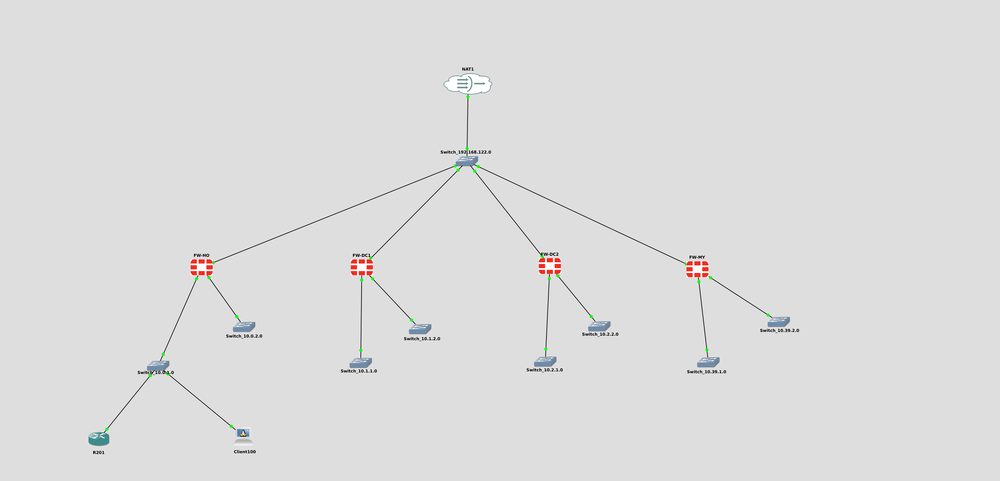
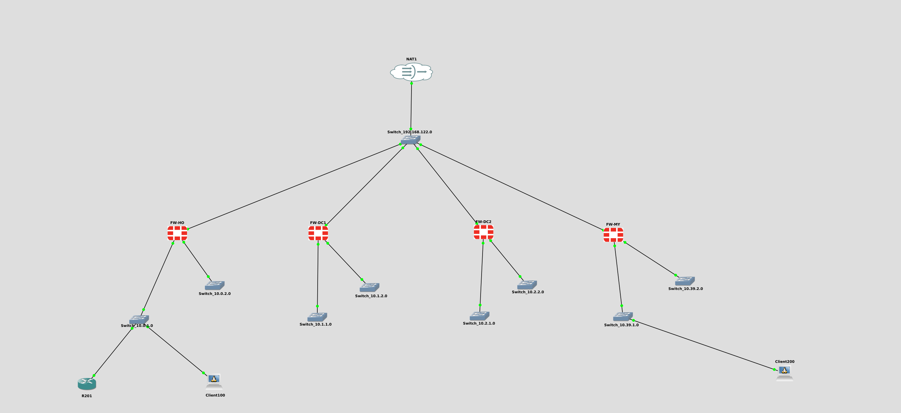

# A6 — Perimeter Firewall Design with FortiGate

```
**Student:** Pase Ayobami
**Site Allocation:** Maynooth — Network `10.39.0.0/16`
**Date:** 22nd March 2026
```


## Diagram



---

## Topology





---

## What I Built

I configured four FortiGate 6.4 firewalls in GNS3, one per site. Each firewall connects to a shared NAT cloud (simulating the internet) on its WAN port, with a protected LAN and DMZ behind it. All four sites are linked by a full-mesh IPsec VPN running over the WAN.

| Site | Firewall | WAN IP (DHCP) | LAN | DMZ |
|------|----------|----------------|-----|-----|
| Head Office | FW-HO | 192.168.122.229 | 10.0.1.0/24 | 10.0.2.0/24 |
| Data Centre 1 | FW-DC1 | 192.168.122.143 | 10.1.1.0/24 | 10.1.2.0/24 |
| Data Centre 2 | FW-DC2 | 192.168.122.6 | 10.2.1.0/24 | 10.2.2.0/24 |
| **Maynooth (my site)** | **FW-MY** | **192.168.122.26** | **10.39.1.0/24** | **10.39.2.0/24** |

---

## What Each Firewall Does

- **WAN (port1)** — receives a DHCP address from the GNS3 NAT cloud; allows ping, HTTPS, HTTP, SSH for management
- **LAN (port2)** — static IP at `.10` of each LAN subnet, protects internal users, NAT applied on outbound traffic
- **DMZ (port3)** — static IP at `.1` of each DMZ subnet, isolates hosted services from the internal LAN
- **VPN** — three IPsec site-to-site tunnels per firewall connecting to the other three sites (12 tunnels total, 6 unique pairs)

---

## How mobile staff and maintenance contractors can access application without compromising security

**Mobile staff** connect using FortiClient SSL VPN. They authenticate against the FortiGate on port1 and are placed into a dedicated VPN IP pool. Firewall policies control which internal resources they can reach.

**Maintenance contractors** use a restricted SSL VPN profile that routes only to the DMZ — they have no route to the internal LAN. A separate user group and time-limited policy enforces this separation.

---

## Interface Configuration

All CLI commands were run via the GNS3 console (right-click firewall → Console).

### Step 1 — Port 1 (WAN) — All Firewalls

```
conf sys int
edit port1
set allowaccess ping https ssh http
next
end
```

WAN addresses confirmed via `get sys int`:

| Firewall | WAN IP |
|----------|--------|
| FW-HO | 192.168.122.229 |
| FW-DC1 | 192.168.122.143 |
| FW-DC2 | 192.168.122.6 |
| FW-MY | 192.168.122.26 |

---

### Step 2 — Port 2 (LAN) — Per Firewall

**FW-HO:**
```
conf sys int
edit port2
set ip 10.0.1.10 255.255.255.0
set allowaccess ping
set alias "Inside"
set role lan
next
end
```

**FW-DC1:**
```
conf sys int
edit port2
set ip 10.1.1.10 255.255.255.0
set allowaccess ping
set alias "Inside"
set role lan
next
end
```

**FW-DC2:**
```
conf sys int
edit port2
set ip 10.2.1.10 255.255.255.0
set allowaccess ping
set alias "Inside"
set role lan
next
end
```

**FW-MY:**
```
conf sys int
edit port2
set ip 10.39.1.10 255.255.255.0
set allowaccess ping
set alias "Inside"
set role lan
next
end
```

---

### Step 3 — Port 3 (DMZ) — Per Firewall

| Firewall | Alias | Role | IP/Netmask |
|----------|-------|------|------------|
| FW-HO | DMZ | DMZ | 10.0.2.1/24 |
| FW-DC1 | DMZ | DMZ | 10.1.2.1/24 |
| FW-DC2 | DMZ | DMZ | 10.2.2.1/24 |
| FW-MY | DMZ | DMZ | 10.39.2.1/24 |

---

## Full Interface Summary

### FW-HO (192.168.122.229)

| Port | Alias | Role | Addressing | IP/Netmask | Access |
|------|-------|------|------------|------------|--------|
| port1 | Outside | WAN | DHCP | 192.168.122.229 | HTTPS, HTTP, SSH, PING |
| port2 | Inside | LAN | Manual | 10.0.1.10/24 | PING |
| port3 | DMZ | DMZ | Manual | 10.0.2.1/24 | PING |

### FW-DC1 (192.168.122.143)

| Port | Alias | Role | Addressing | IP/Netmask | Access |
|------|-------|------|------------|------------|--------|
| port1 | Outside | WAN | DHCP | 192.168.122.143 | HTTPS, HTTP, SSH, PING |
| port2 | Inside | LAN | Manual | 10.1.1.10/24 | PING |
| port3 | DMZ | DMZ | Manual | 10.1.2.1/24 | PING |

### FW-DC2 (192.168.122.6)

| Port | Alias | Role | Addressing | IP/Netmask | Access |
|------|-------|------|------------|------------|--------|
| port1 | Outside | WAN | DHCP | 192.168.122.6 | HTTPS, HTTP, SSH, PING |
| port2 | Inside | LAN | Manual | 10.2.1.10/24 | PING |
| port3 | DMZ | DMZ | Manual | 10.2.2.1/24 | PING |

### FW-MY (192.168.122.26)

| Port | Alias | Role | Addressing | IP/Netmask | Access |
|------|-------|------|------------|------------|--------|
| port1 | Outside | WAN | DHCP | 192.168.122.26 | HTTPS, HTTP, SSH, PING |
| port2 | Inside | LAN | Manual | 10.39.1.10/24 | PING |
| port3 | DMZ | DMZ | Manual | 10.39.2.1/24 | PING |

---

## Firewall Address Objects

Run on each firewall to define the LAN address object used in policies:

**FW-HO:**
```
config firewall address
edit "InsideLan"
set associated-interface port2
set subnet 10.0.1.0 255.255.255.0
end
```

**FW-DC1:**
```
config firewall address
edit "InsideLan"
set associated-interface port2
set subnet 10.1.1.0 255.255.255.0
end
```

**FW-DC2:**
```
config firewall address
edit "InsideLan"
set associated-interface port2
set subnet 10.2.1.0 255.255.255.0
end
```

**FW-MY:**
```
config firewall address
edit "InsideLan"
set associated-interface port2
set subnet 10.39.1.0 255.255.255.0
end
```

Verified with: `show firewall address`

---

## Firewall Policy — LAN to WAN (NAT)

The following policy is identical on all four firewalls. It allows internal users to reach the internet with NAT applied:

```
config firewall policy
edit 1
set name "Inside->Outside"
set srcintf port2
set dstintf port1
set srcaddr InsideLan
set dstaddr all
set action accept
set schedule always
set service ALL
set nat enable
next
end
```

Verified with: `show firewall policy`

---

## End-Host Configuration

### R201 (Cisco Router — HO LAN)

R201 is connected to Switch_10.0.1.0 on the HO LAN:

```
hostname R201
int FastEthernet0/0
 ip address 10.0.1.201 255.255.255.0
 no shut
 exit
ip domain-name netcp901.ie
crypto key generate rsa general-keys modulus 1024
ip ssh version 2
line vty 0 4
 transport input ssh
 login local
 exit
username admin password Passw0rd
ip route 0.0.0.0 0.0.0.0 10.0.1.10
```

### Client100 (Linux Ubuntu Docker — HO LAN)

| Field | Value |
|-------|-------|
| IP Address | 10.0.1.100 |
| Subnet Mask | 255.255.255.0 |
| Default Gateway | 10.0.1.10 |


### Client200 (Linux Ubuntu Docker — MY LAN)

| Field | Value |
|-------|-------|
| IP Address | 10.39.1.1 |
| Subnet Mask | 255.255.255.0 |
| Default Gateway | 10.39.1.10 |


**Connectivity tests from R201:**
```
ping 10.0.1.10    ← confirms R201 can reach FW-HO LAN gateway
ping 8.8.8.8      ← confirms internet access through NAT policy
```

---

## VPN Tunnels

Twelve IPsec tunnels in total (three per firewall), forming six unique site-to-site pairs. All configured via VPN > IPsec Wizard in the FortiGate GUI with the following settings applied consistently:

- Template: Site to Site
- Remote device: FortiGate
- Outgoing Interface: WAN (port1)
- Pre-shared key: `ElectricPetrolVPN123`
- NAT: No NAT between sites
- Internet Access: None

| Tunnel Name | Firewall | Remote IP | Local Subnet | Remote Subnet |
|-------------|----------|-----------|--------------|---------------|
| VPN-HO-to-DC1 | FW-HO | 192.168.122.143 | 10.0.1.0/24 | 10.1.1.0/24 |
| VPN-HO-to-DC2 | FW-HO | 192.168.122.6 | 10.0.1.0/24 | 10.2.1.0/24 |
| VPN-HO-to-MY | FW-HO | 192.168.122.26 | 10.0.1.0/24 | 10.39.1.0/24 |
| VPN-DC1-to-HO | FW-DC1 | 192.168.122.229 | 10.1.1.0/24 | 10.0.1.0/24 |
| VPN-DC1-to-DC2 | FW-DC1 | 192.168.122.6 | 10.1.1.0/24 | 10.2.1.0/24 |
| VPN-DC1-to-MY | FW-DC1 | 192.168.122.26 | 10.1.1.0/24 | 10.39.1.0/24 |
| VPN-DC2-to-HO | FW-DC2 | 192.168.122.229 | 10.2.1.0/24 | 10.0.1.0/24 |
| VPN-DC2-to-DC1 | FW-DC2 | 192.168.122.143 | 10.2.1.0/24 | 10.1.1.0/24 |
| VPN-DC2-to-MY | FW-DC2 | 192.168.122.26 | 10.2.1.0/24 | 10.39.1.0/24 |
| VPN-MY-to-HO | FW-MY | 192.168.122.229 | 10.39.1.0/24 | 10.0.1.0/24 |
| VPN-MY-to-DC1 | FW-MY | 192.168.122.143 | 10.39.1.0/24 | 10.1.1.0/24 |
| VPN-MY-to-DC2 | FW-MY | 192.168.122.6 | 10.39.1.0/24 | 10.2.1.0/24 |

### Bringing Tunnels Up via CLI

**FW-HO:**
```
diagnose vpn tunnel up VPN-HO-to-DC1
diagnose vpn tunnel up VPN-HO-to-DC2
diagnose vpn tunnel up VPN-HO-to-MY
```

**FW-DC1:**
```
diagnose vpn tunnel up VPN-DC1-to-HO
diagnose vpn tunnel up VPN-DC1-to-DC2
diagnose vpn tunnel up VPN-DC1-to-MY
```

**FW-DC2:**
```
diagnose vpn tunnel up VPN-DC2-to-HO
diagnose vpn tunnel up VPN-DC2-to-DC1
diagnose vpn tunnel up VPN-DC2-to-MY
```

**FW-MY:**
```
diagnose vpn tunnel up VPN-MY-to-HO
diagnose vpn tunnel up VPN-MY-to-DC1
diagnose vpn tunnel up VPN-MY-to-DC2
```

Tunnel status verified via VPN > IPsec Tunnels in the GUI — all tunnels show up.

---

## Files in This Folder

| File | Description |
|------|-------------|
| `FW-HO-diff.txt` | Config diff output from FW-HO |
| `FW-DC1-diff.txt` | Config diff output from FW-DC1 |
| `FW-DC2-diff.txt` | Config diff output from FW-DC2 |
| `FW-MY-diff.txt` | Config diff output from FW-MY (my site) |
| `A6_Topology.png` | Network topology diagram |
| `A6_Topology_2.png` | Network topology diagram  1 |
| `A6_Topology_3.png` | Network topology diagram  2 |
| `A6_diagram.drawio.png` | Original Draw.io network design diagram |
| `README.md` | This document |

---

## Tests Conducted

### Test 1 — Interface Verification
`show system interface` — confirmed port1 received DHCP, port2 and port3 show correct static IPs, aliases, and roles on all four firewalls.

### Test 2 — Firewall Address Objects
`show firewall address` — confirmed InsideLan object present on each firewall with correct subnet and associated interface.

### Test 3 — Firewall Policies
`show firewall policy` — confirmed policy ID 1 (Inside->Outside) present on all four firewalls with NAT enabled.

### Test 4 — LAN-to-WAN Connectivity

**Connectivity Tests from R201:**
```
ping 10.0.1.10    ← confirms R201 can reach FW-HO LAN interface (80% success, 4/5 packets)
```

**Connectivity Tests from Client100:**
```
ping 10.0.1.10    ← confirms Client100 can reach FW-HO LAN gateway (0% packet loss, 10/10 packets)
```

**Connectivity Tests from Client200:**
```
ping 10.39.1.10   ← confirms Client200 can reach FW-MY LAN gateway (0% packet loss, 10/10 packets)
```

### Test 5 — VPN Status
VPN > IPsec Tunnels in GUI — brought all 12 tunnels up and confirmed green status across all six site pairs.

### Test 6 — Cross-Site Ping
Pinged `10.39.1.100` (FW-MY LAN) from Client100 (10.0.1.100, HO LAN) — successful, confirming VPN-HO-to-MY tunnel is passing traffic.


---

